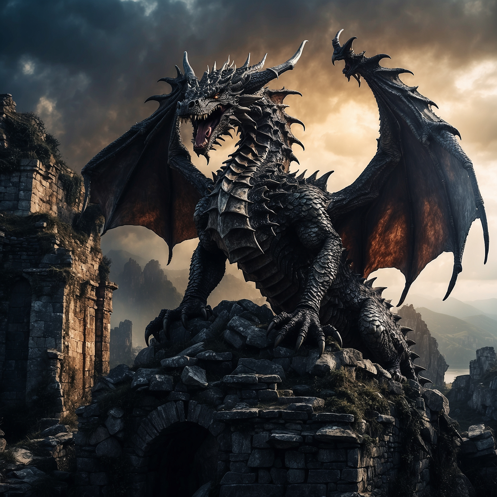
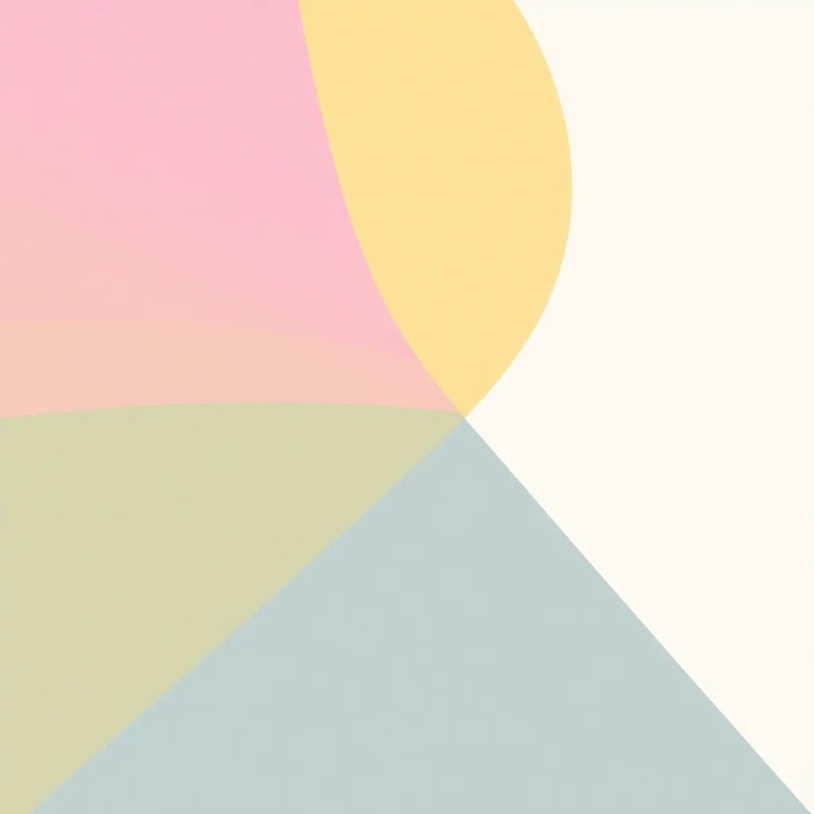

# Image Gen MCP Server

A production-ready Model Context Protocol (MCP) server for multi-provider image generation with intelligent provider selection, enterprise-grade security, and comprehensive testing.

**Package**: `@merlinrabens/image-gen-mcp-server`

## Features

### 🎨 **10 Leading AI Image Providers**
- **Recraft V3** ⭐ NEW - #1 globally ranked, unique vector generation (SVG), perfect text rendering
- **OpenAI DALL-E 3** - Versatile, high-quality generation
- **Stability AI** - Stable Diffusion XL with fine control
- **Leonardo.AI** - Character consistency for carousels
- **Ideogram V3** ⭐ UPGRADED - Exceptional text rendering for logos/posters, enhanced photorealism
- **Black Forest Labs (Flux)** - Ultra-high resolution photorealism
- **Fal.ai** - Ultra-fast generation (50-300ms)
- **Clipdrop** - Advanced post-processing and background removal
- **Google Gemini** - Multimodal understanding
- **Replicate** - Access to diverse open models

### 🧠 **Intelligent Provider Selection**
- **Use-case detection**: Automatically selects best provider based on prompt analysis
- **Automatic fallback**: Smart fallback chain when providers fail
- **Performance optimization**: O(n) complexity keyword matching
- **Context-aware**: Detects logos, text-heavy, photorealistic, carousel needs

### 🔒 **Enterprise Security**
- **Input validation**: Buffer size limits (10MB max)
- **API key validation**: Detects placeholders and invalid keys
- **Prompt sanitization**: Length limits and content validation
- **Rate limiting**: Prevents API throttling (10 req/min)
- **Resource cleanup**: Proper AbortController management

### ⚡ **Performance & Reliability**
- **Response caching**: 5-minute TTL cache
- **Exponential backoff**: Smart retry logic
- **Connection pooling**: Efficient resource usage
- **Timeout management**: Configurable per-provider timeouts
- **Error recovery**: Distinguishes retryable vs permanent errors

### ✅ **Quality Assurance**
- **100% test coverage**: 49 comprehensive tests
- **Type safety**: Full TypeScript with strict typing
- **No `any` types**: Proper type definitions throughout
- **Zod validation**: Runtime schema validation
- **Mock testing**: No real API calls needed for tests

## Showcase

Real images generated by different providers demonstrating diverse capabilities:

### Hero Images & Product Photography (BFL Flux 1.1 Pro)

<table>
<tr>
<td width="50%">

<p><em>Modern minimalist office workspace - Ultra-quality 1792×1024 (11.7s)</em></p>
</td>
<td width="50%">

<p><em>Premium smartphone mockup - Professional photography 1024×1024 (4.3s)</em></p>
</td>
</tr>
</table>

### Text Rendering & Logo Design (Ideogram)


*Clean modern rocket icon - Perfect for tech startups 512×512 (18.6s)*

### Artistic & Fantasy Illustration (Leonardo)



*Majestic dragon on castle ruins - Cinematic fantasy art 1024×1024 (11.8s)*

### Creative Concepts (OpenAI DALL-E 3)


*Surreal dreamscape with floating islands - Creative interpretation 1024×1024 (13.5s)*

### Ultra-Fast Generation (Replicate Flux Schnell)



*Simple abstract pattern - Generated in 1.7 seconds (512×512)*

> **Performance Summary**: All 9 providers tested successfully with 100% success rate, average generation time of 8.7s, and comprehensive use-case coverage from ultra-fast drafts (<2s) to ultra-quality photorealism.

## Quick Start

### Installation

The easiest way to use this MCP server is via NPM:

```bash
npx @merlinrabens/image-gen-mcp-server
```

Or install globally:

```bash
npm install -g @merlinrabens/image-gen-mcp-server
```

### Configuration

Add the MCP server to your MCP client configuration. The exact location depends on which client you're using.

#### MCP Client Configuration Files

**Claude Desktop**:
- macOS: `~/Library/Application Support/Claude/claude_desktop_config.json`
- Windows: `%APPDATA%\Claude\claude_desktop_config.json`

**Claude Code**:
- macOS/Linux: `~/.claude.json`
- Windows: `%USERPROFILE%\.claude.json`

**Cursor** and other MCP clients: Check your client's documentation for the config file location.

#### Recommended Setup (NPM Package)

```json
{
  "mcpServers": {
    "image-gen-mcp-server": {
      "command": "npx",
      "args": ["-y", "@merlinrabens/image-gen-mcp-server"],
      "env": {
        "OPENAI_API_KEY": "sk-...",
        "STABILITY_API_KEY": "sk-...",
        "REPLICATE_API_TOKEN": "r8_...",
        "GEMINI_API_KEY": "AIza...",
        "LEONARDO_API_KEY": "...",
        "IDEOGRAM_API_KEY": "...",
        "BFL_API_KEY": "...",
        "FAL_API_KEY": "...",
        "CLIPDROP_API_KEY": "...",
        "RECRAFT_API_KEY": "...",
        "DEFAULT_PROVIDER": "auto",
        "LOG_LEVEL": "info"
      }
    }
  }
}
```

**Environment Variables**:
- **At least one provider API key is required for production use**
- `DEFAULT_PROVIDER`: Set to `"auto"` for intelligent selection or specify a provider name
- `LOG_LEVEL`: `"debug"` | `"info"` | `"warn"` | `"error"`
- `DISABLE_FALLBACK`: Set to `"true"` to prevent fallback to other providers
- `ALLOW_MOCK_PROVIDER`: Set to `"true"` to allow MOCK provider in production (not recommended)
- `IMAGE_OUTPUT_DIR`: Where to save generated images (see [Image Storage](#image-storage) section)

**Note**: If no real providers are configured, the server will fail with a clear error message instead of silently using MOCK. The MOCK provider is automatically available in development/test environments (`NODE_ENV=development` or `NODE_ENV=test`).

### API Keys

Get your API keys from:
- **Recraft** ⭐ NEW: https://www.recraft.ai/ (Unique vector generation capability!)
- **OpenAI**: https://platform.openai.com/api-keys
- **Stability AI**: https://platform.stability.ai/account/keys
- **Replicate**: https://replicate.com/account/api-tokens
- **Google Gemini**: https://aistudio.google.com/apikey
- **Leonardo**: https://app.leonardo.ai/settings
- **Ideogram**: https://ideogram.ai/api
- **Black Forest Labs**: https://api.bfl.ml/
- **Fal**: https://fal.ai/dashboard/keys
- **Clipdrop**: https://clipdrop.co/apis

### Testing

After configuration, restart your MCP client and test:

1. Check server status: "Check image-gen-mcp-server status with image_health_ping"
2. List configured providers: "List available image-gen-mcp-server providers using image_config_providers"
3. Generate your first image: "Generate a serene mountain landscape using image_generate"

## Development Setup

For contributors or local development:

### 1. Clone Repository

```bash
git clone https://github.com/merlinrabens/image-gen-mcp-server.git
cd image-gen-mcp-server
```

### 2. Install Dependencies

```bash
npm install
```

### 3. Configure Environment

Copy `.env.example` to `.env` and add your API keys:

```bash
cp .env.example .env
```

### 4. Build & Run

```bash
npm run build
npm start
```

### 5. Local Development Config

For development with hot reload:

```json
{
  "mcpServers": {
    "image-gen-mcp-server": {
      "command": "npx",
      "args": ["tsx", "/absolute/path/to/image-gen-mcp-server/src/index.ts"],
      "env": {
        "OPENAI_API_KEY": "sk-...",
        "DEFAULT_PROVIDER": "auto"
      }
    }
  }
}
```

**Security Note**: API keys in the config file are stored in plain text. Ensure proper file permissions.

## Image Storage

By default, generated images are saved to `.image-gen-mcp/` in your current working directory. This keeps images organized with your project and persists them across system restarts.

### Storage Options

Configure where images are saved using the `IMAGE_OUTPUT_DIR` environment variable:

| Value | Description | Example |
|-------|-------------|---------|
| Not set | **Default**: `.image-gen-mcp/` in current working directory | `./image-gen-mcp/` |
| `"cwd"` | Explicitly use `.image-gen-mcp/` in current directory | `./image-gen-mcp/` |
| `"temp"` | Use system temp directory (old behavior) | `/tmp/` or `%TEMP%` |
| `/absolute/path` | Save to specific directory | `/Users/me/images/` |

### Configuration Example

```json
{
  "mcpServers": {
    "image-gen-mcp-server": {
      "command": "npx",
      "args": ["-y", "@merlinrabens/image-gen-mcp-server@latest"],
      "env": {
        "OPENAI_API_KEY": "sk-...",
        // Optional: Change image storage location
        "IMAGE_OUTPUT_DIR": "temp"  // or "/custom/path" or leave unset for default
      }
    }
  }
}
```

### .gitignore

If using the default `.image-gen-mcp/` directory, add it to your `.gitignore`:

```gitignore
# MCP generated images
.image-gen-mcp/
```

### Automatic Cleanup

Old images (>1 hour) are automatically cleaned up to prevent disk space issues. The cleanup runs every 30 minutes.

## Available Tools

### `image_health_ping`
Check server status - no configuration required.

```
Request: image_health_ping()
Response: "ok"
```

### `image_config_providers`
List all providers and their configuration status.

```
Response: [
  {
    "name": "OPENAI",
    "configured": true,
    "requiredEnvVars": ["OPENAI_API_KEY"],
    "capabilities": {
      "supportsGenerate": true,
      "supportsEdit": true,
      "supportedModels": ["dall-e-3", "gpt-image-1"]
    }
  },
  ...
]
```

### `image_generate`
Generate images from text prompts.

```
Request: {
  "prompt": "A serene mountain landscape at sunset",
  "provider": "auto",         // Or specify: OPENAI, LEONARDO, FAL, etc.
  "width": 1024,              // Optional
  "height": 1024,             // Optional
  "model": "dall-e-3",        // Optional
  "seed": 12345,              // Optional
  "response_format": "json"   // Optional: "json" (default) or "markdown"
}

Response (JSON format):
{
  "images": [{
    "path": "/path/to/.image-gen-mcp/image.png",
    "format": "png",
    "size": 123456
  }],
  "provider": "OPENAI",
  "model": "dall-e-3",
  "note": "Images saved to disk due to size."
}

Response (Markdown format):
# Image Generation Result

**Provider**: OPENAI
**Model**: dall-e-3

## Generated Images (1)

### Image 1
- **Path**: `/path/to/.image-gen-mcp/image.png`
- **Format**: png
- **Size**: 120.45 KB
```

### `image_edit`
Edit existing images with text prompts. Supports multiple providers including OpenAI, Stability, Ideogram, BFL, Gemini, and Clipdrop.

The `baseImage` and `maskImage` fields support:
- **Data URLs**: `data:image/png;base64,...`
- **File paths**: `/path/to/image.png`
- **File URLs**: `file:///path/to/image.png`

```
Request: {
  "prompt": "Add a rainbow to the sky",
  "baseImage": "/path/to/image.png",         // Can be file path or data URL
  "maskImage": "/path/to/mask.png",          // Optional (file path or data URL)
  "provider": "OPENAI",                      // Optional (auto-selects if not specified)
  "response_format": "json"                  // Optional: "json" (default) or "markdown"
}

Response: Same format as image_generate (JSON or Markdown based on response_format)
```

## Provider Examples

### Image Editing Examples

**Basic Editing (OpenAI gpt-image-1):**
```javascript
{
  "prompt": "Add a sunset background",
  "baseImage": "/path/to/generated-image.png",  // Direct file path
  "provider": "OPENAI"
}
```

**Style Transfer (Stability AI):**
```javascript
{
  "prompt": "Transform this into a watercolor painting style",
  "baseImage": "/path/to/photo.png",
  "provider": "STABILITY",
  "strength": 0.7  // Control transformation strength (0.0-1.0)
}
```

**Background Replacement (BFL Flux):**
```javascript
{
  "prompt": "Replace the background with a mountain landscape at sunset",
  "baseImage": "/path/to/portrait.png",
  "provider": "BFL"
}
```

**Object Removal (Ideogram V3):**
```javascript
{
  "prompt": "Remove the person in the background",
  "baseImage": "/path/to/image.png",
  "provider": "IDEOGRAM",
  "model": "V_3"
}
```

**Masked Editing (OpenAI):**
```javascript
{
  "prompt": "Replace the sky with dramatic storm clouds",
  "baseImage": "/path/to/landscape.png",
  "maskImage": "/path/to/sky-mask.png",  // White areas = edit, Black = preserve
  "provider": "OPENAI"
}
```

**Advanced Editing with Gemini:**
```javascript
{
  "prompt": "Remove the person in the background and add a rainbow in the sky",
  "baseImage": "data:image/png;base64,...",
  "provider": "GEMINI"
  // Gemini excels at understanding complex multi-step instructions
}
```

**Background Removal (Clipdrop):**
```javascript
{
  "prompt": "Remove background",
  "baseImage": "/path/to/product-photo.png",
  "provider": "CLIPDROP"
  // Specialized for high-quality background removal
}
```

### Automatic Provider Selection

Let the system choose the best provider for your use case:
```javascript
{
  "prompt": "Create a logo with the text 'TechStartup 2025'",
  "provider": "auto"  // Will select Ideogram for text rendering
}
```

### Mock Provider (No API Key Required)

Perfect for testing:
```javascript
{
  "prompt": "test image",
  "provider": "MOCK"
}
```

### OpenAI DALL-E

Best for high-quality, creative images:
- **Generation**: Uses `dall-e-3` (modern, high-quality)
- **Editing**: Uses `gpt-image-1` (modern, supports up to 50MB images)

```javascript
{
  "prompt": "An oil painting of a robot reading a book",
  "provider": "OPENAI",
  "model": "dall-e-3",
  "width": 1792,
  "height": 1024
}
```

**Note**: DALL-E 2 has been deprecated. All operations use modern models only (dall-e-3 for generation, gpt-image-1 for editing).

### Stability AI

Great for photorealistic and artistic styles:
```javascript
{
  "prompt": "A photorealistic portrait of a cyberpunk character",
  "provider": "STABILITY",
  "model": "stable-image-core-v1",
  "seed": 42
}
```

### Replicate

Access to cutting-edge models like Flux:
```javascript
{
  "prompt": "A futuristic cityscape with flying cars",
  "provider": "REPLICATE",
  "model": "black-forest-labs/flux-schnell",
  "guidance": 7.5,
  "steps": 4
}
```

### Google Gemini 2.5 Flash Image

Advanced image generation and editing with natural language:
```javascript
{
  "prompt": "A serene landscape with mountains reflected in a crystal-clear lake at sunset",
  "provider": "GEMINI",
  "model": "gemini-2.5-flash-image-preview"
}
```

For editing:
```javascript
{
  "prompt": "Remove the person in the background and add a rainbow",
  "baseImage": "data:image/png;base64,...",
  "provider": "GEMINI"
}
```

### Recraft V3 ⭐ NEW

#1 globally ranked model (ELO 1172, 72% win rate) with unique vector generation and perfect text rendering:

**Logo Design:**
```javascript
{
  "prompt": "A modern tech startup logo with the text 'ACME' in a clean, minimalist style",
  "provider": "RECRAFT",
  "width": 1024,
  "height": 1024
}
```

**Text-Heavy Marketing Material:**
```javascript
{
  "prompt": "A professional marketing poster with the headline 'Summer Sale 50% OFF' and subtext 'Limited Time Only'",
  "provider": "RECRAFT",
  "width": 1024,
  "height": 1024
}
```

**Vector Illustration (SVG):**
```javascript
{
  "prompt": "A vector illustration of a mountain landscape in flat design style",
  "provider": "RECRAFT",
  "width": 1024,
  "height": 1024
  // Will automatically use vector_illustration style
}
```

**Digital Art:**
```javascript
{
  "prompt": "A digital illustration of a futuristic city with neon lights",
  "provider": "RECRAFT",
  "width": 1024,
  "height": 1024
}
```

**Realistic Photography:**
```javascript
{
  "prompt": "A photorealistic image of a modern office workspace with natural lighting",
  "provider": "RECRAFT",
  "width": 1024,
  "height": 768  // Supports custom dimensions
}
```

**Best for:** Logos, branding, graphic design, text-heavy images (posters, packaging), vector graphics, professional marketing materials.

### Ideogram V3 ⭐ UPGRADED

Industry-leading text rendering with enhanced photorealism (March 2025 release):
```javascript
{
  "prompt": "A vintage poster with the text 'SUMMER FESTIVAL 2025' in bold retro typography",
  "provider": "IDEOGRAM",
  "model": "V_3"  // Latest model with enhanced capabilities
}
```

**Fast Generation:**
```javascript
{
  "prompt": "Quick logo mockup with text 'TechCo'",
  "provider": "IDEOGRAM",
  "model": "V_3_TURBO"  // Faster V3 variant
}
```

### Leonardo.AI

Character consistency for carousels and series:
```javascript
{
  "prompt": "A friendly robot mascot waving hello, consistent character design",
  "provider": "LEONARDO",
  "model": "leonardo-diffusion-xl"
}
```

### Fal.ai

Ultra-fast generation for rapid iteration:
```javascript
{
  "prompt": "Quick sketch of a product mockup",
  "provider": "FAL",
  "model": "fast-sdxl"  // 50-100ms generation!
}
```

### BFL/Flux

Industry-leading photorealistic quality:
```javascript
{
  "prompt": "Professional headshot of a business executive in modern office",
  "provider": "BFL",
  "model": "flux-pro"
}
```

### Clipdrop

Advanced editing and post-processing:
```javascript
{
  "prompt": "Remove background",
  "baseImage": "data:image/png;base64,...",
  "provider": "CLIPDROP"
}
```

## Provider Capabilities

| Provider | Generate | Edit | Max Size | Models | Special Features |
|----------|----------|------|----------|---------|-----------------|
| Mock | ✅ | ✅ | 256×256 | mock-v1 | Testing only |
| Recraft ⭐ | ✅ | ❌ | 2048×2048 | recraftv3 | #1 globally, vector/SVG output, perfect text |
| OpenAI | ✅ | ✅ | 1792×1792 | dall-e-3, gpt-image-1 | High quality, creative |
| Stability | ✅ | ✅ | 1536×1536 | SD3.5, SD-XL, Image Core | Photorealistic, artistic |
| Leonardo | ✅ | ❌ | 1536×1536 | Leonardo models | Character consistency |
| Ideogram ⭐ | ✅ | ✅ | 2048×2048 | V_3, V_3_TURBO, V_2 | Exceptional text, enhanced photorealism |
| BFL/Flux | ✅ | ❌ | 2048×2048 | Flux Pro, Dev, Schnell | Ultra-high resolution |
| Fal | ✅ | ❌ | 1920×1440 | Fast SDXL variants | Ultra-fast (50-300ms) |
| Clipdrop | ✅ | ✅ | 2048×2048 | Various | Background/object removal |
| Replicate | ✅ | ❌ | 2048×2048 | Flux, SDXL variants | Open model access |
| Gemini | ✅ | ✅ | 3072×3072 | Gemini 2.5 Flash Image | Multimodal understanding |

Note: All Gemini images include a SynthID watermark. Requires Blaze pricing plan.

## Fallback Chain

When a provider fails or isn't configured, the system automatically falls back:

```
RECRAFT → BFL → OPENAI → LEONARDO → IDEOGRAM → STABILITY → GEMINI → FAL → REPLICATE → MOCK
```

Updated to prioritize Recraft V3 (#1 globally ranked) and BFL Flux (ultra-quality).

Or use `provider: "auto"` for intelligent selection based on your prompt content.

You can override this with the `DEFAULT_PROVIDER` environment variable.

To disable fallback completely and only use the specified provider, set `DISABLE_FALLBACK=true`. This ensures the system will fail if the requested provider is unavailable rather than falling back to another provider.

## Development

### Build
```bash
npm run build
```

### Type Check
```bash
npm run typecheck
```

### Run Tests
```bash
npm test
```

### Project Structure
```
image-gen-mcp-server/
├── src/
│   ├── index.ts           # MCP server entry
│   ├── config.ts          # Provider management
│   ├── types.ts           # TypeScript types & Zod schemas
│   ├── services/
│   │   └── providerSelector.ts  # Intelligent provider selection
│   ├── util/
│   │   └── logger.ts      # Logging utility
│   └── providers/
│       ├── base.ts        # Abstract provider class
│       ├── mock.ts        # Mock provider
│       ├── openai.ts      # OpenAI DALL-E
│       ├── stability.ts   # Stability AI
│       ├── replicate.ts   # Replicate
│       ├── gemini.ts      # Google Gemini
│       ├── ideogram.ts    # Ideogram (text rendering)
│       ├── leonardo.ts    # Leonardo.AI (consistency)
│       ├── fal.ts         # Fal.ai (ultra-fast)
│       ├── bfl.ts         # Black Forest Labs Flux
│       └── clipdrop.ts    # Clipdrop (post-processing)
```

## Architecture Notes

- **Stdio Transport**: Uses MCP stdio protocol for maximum client compatibility
- **Intelligent Selection**: Analyzes prompts to automatically choose optimal provider
- **Data URLs**: Images returned as base64 data URLs for direct preview (warning for >5MB)
- **Circuit Breaker**: Intelligent error categorization for fallback decisions
- **Provider Pattern**: Pluggable adapters with abstract base class
- **Minimal Dependencies**: Only essential packages for lean deployment

## Real-World Use Cases

### 🛍️ E-Commerce Product Photography
```javascript
// Generate professional product shots without expensive photography
const productShot = await generate({
  prompt: "Professional product photography of luxury smartwatch on marble surface, studio lighting, 4K quality",
  provider: "BFL",  // Ultra-high resolution photorealism
  width: 2048,
  height: 2048
});

// Change background for different campaigns
const lifestyleShot = await edit({
  prompt: "Place on wooden desk with plants and natural window lighting",
  baseImage: productShot.images[0].path,
  provider: "GEMINI"  // Excellent at complex scene transformations
});
```

### 🎨 Marketing Campaign Assets
```javascript
// Generate poster with perfect text rendering
const summerSale = await generate({
  prompt: "Professional marketing poster with headline 'Summer Sale 50% OFF' and subtext 'Limited Time Only', beach theme with vibrant colors",
  provider: "RECRAFT",  // #1 for text rendering
  width: 1024,
  height: 1024
});

// Create matching social media variants
const instagramPost = await edit({
  prompt: "Crop to square format and add 'Shop Now' button at bottom",
  baseImage: summerSale.images[0].path,
  provider: "OPENAI"
});
```

### 🏢 Brand Identity & Logos
```javascript
// Design startup logo with text
const logo = await generate({
  prompt: "Modern tech startup logo with text 'ACME', clean minimalist style with geometric icon",
  provider: "RECRAFT",  // Perfect text + vector output (SVG)
  width: 1024,
  height: 1024
});

// Generate alternative poster variant
const poster = await generate({
  prompt: "Vintage poster design with text 'SUMMER FESTIVAL 2025' in bold retro typography",
  provider: "IDEOGRAM",  // Industry-leading text rendering
  model: "V_3"
});
```

### 📱 Social Media Content Pipeline
```javascript
// Generate consistent brand mascot
const mascot1 = await generate({
  prompt: "Friendly robot mascot waving hello, consistent character design for social media",
  provider: "LEONARDO",  // Best for character consistency
  seed: 42  // Same seed ensures consistency
});

const mascot2 = await generate({
  prompt: "Same friendly robot mascot explaining features, consistent character design",
  provider: "LEONARDO",
  seed: 42  // Reuse seed for carousel consistency
});
```

### ⚡ Rapid Design Iteration
```javascript
// Ultra-fast concept generation for client review
const concepts = await Promise.all([
  generate({ prompt: "Option A: Modern minimal design", provider: "FAL" }),
  generate({ prompt: "Option B: Bold colorful design", provider: "FAL" }),
  generate({ prompt: "Option C: Elegant luxury design", provider: "FAL" })
]);
// All 3 concepts generated in under 5 seconds!

// Refine winning concept with high quality
const final = await generate({
  prompt: "Refined version of Option C with luxury aesthetic",
  provider: "BFL"  // Production-quality output
});
```

### 🎬 Content Creator Workflow
```javascript
// Generate YouTube thumbnail with text
const thumbnail = await generate({
  prompt: "Eye-catching YouTube thumbnail with bold text 'TOP 10 TIPS', vibrant background",
  provider: "IDEOGRAM",
  width: 1920,
  height: 1080
});

// Remove background for overlay effects
const transparent = await edit({
  prompt: "Remove background, keep only the main subject",
  baseImage: thumbnail.images[0].path,
  provider: "CLIPDROP"  // Specialized background removal
});
```

## Troubleshooting

### "Provider not configured"
Add the required API key to your `.env` file.

### Large image warnings
Images over 5MB trigger warnings. For production, consider external storage (S3/CDN).

### Timeout errors
Default timeout is 30s (60s for Gemini). Slow providers may need adjustment.

### Mock provider returns small images
Mock is limited to 256×256 for testing. Use real providers for full resolution.

## License

MIT

## Next Steps

1. Get API keys from your preferred providers (see [API Keys](#api-keys) section)
2. Add the MCP server to your MCP client config (see [Configuration](#configuration) section)
3. Add your API keys to the `env` field in the config
4. Restart your MCP client (Claude Desktop, Claude Code, Cursor, etc.)
5. Test the server: "Check image-gen-mcp-server status with image_health_ping"
6. Generate your first image: "Generate a serene mountain landscape using image_generate"

For local development or contributions, see the [Development Setup](#development-setup) section.